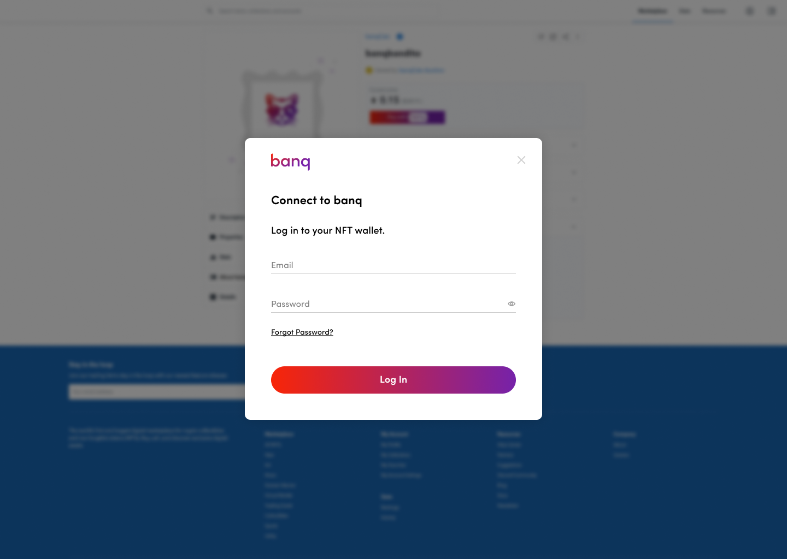

# Overview

Our **"NFT Linking"** widget enables platforms to quickly process migrating NFTs from banq Account to any other platform of NFC.



## Main Entities

The Banq is source and platform is a destination in migrate example:

 - Banq services:
   - Open API
   - NFT Linking widget
   - NFT Web App
 - NFT Platform _(the platform should has an account on Banq)_
 - User _(Owner of NFTs)_


# Native JavaScript

The simplest way is adding html's block on your web page.

```html
<script src="https://walletnft-widget.sandbox.banq.com/ecommerce.js"></script>
<div id="nft-link-banq"></div>
<script>
  const app = new window.ecommerceBanqWidget({
    selector: '#nft-link-banq',
    // `platformId` is from `banq/AccountSpace`
    platformId: "00000000-0000-0000-0000-000000000000",
    // this function will trigger callback when user will close widget
    onPopUpClose: () => {
      console.log('pop up is closed action');
    },
    // this function will trigger callback after success payment
    onPaymentSuccess: () => {
      console.log('this triggers after payment completed successfully');
    }
  });
  app.bootstrapApp();
</script>
```

# Installation

To install the stable version, run:

```sh
npm install --save @banq/wallet-nft-widget
# or
yarn add @banq/wallet-nft-widget
```

# Usage

Add this import to starting point of your project such as: index.js or index.ts files

```ts
import '@banq/wallet-nft-widget'
```

Create a `<link-nft-widget-dialog />` element with required attributes mentioned below.

```tsx
  <link-nft-widget-dialog platformId="<PLATFORM_ID>" />
```

### Attributes:

| Name           | Required |                                  Description |
| -------------- | :------: | -------------------------------------------: |
| environment    |          | For testing use other environment            |
| platformId     |    ✔     | platformId from banq/AccountSpace/platformId |

### Events:
| Name            |                     Description |
| --------------- | ------------------------------: |
| close           | Fires after widget closes       |
| successPayment  | Fires when user creates payment |

Create a `<link-nft-banq-button />` element with required attributes mentioned below.

```html
<link-nft-banq-button
  className="buttonStyle"
  disabled="false"
  loading="false"
  error="false"
/>
```

### Attributes:

| Name            | Required |                   Description |
| --------------- | :------: | ----------------------------: |
| className       |          | For styling button            |
| disabled        |          | Disables pay with banq button |
| loading         |          | Shows loading indicator       |
| error           |          | Shows error indicator         |
